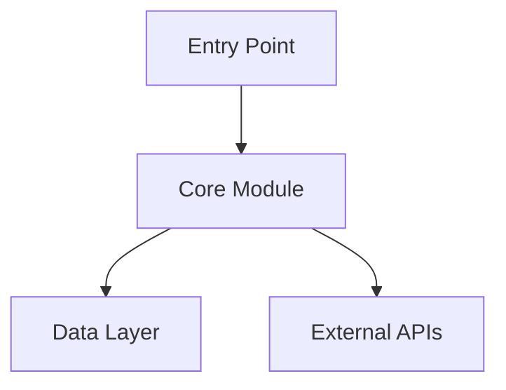

# Project Knowledge Wiki

Compiles a codebase into a living Obsidian wiki by reading source files and git history directly. No need to drop files into `raw/` — the repo is the source.

**First action:** check for `kb-project.yaml` in the project root. If missing, run `init` first.

## What Gets Compiled

| Article type | Source |
|---|---|
| Architecture overview | Directory structure, key modules, how they connect |
| Module articles | Per-directory: purpose, key files, public API surface |
| Decision records | Git log, commit messages, PR descriptions, major refactors |
| Evolution timeline | When things were added, removed, renamed, rewritten |
| Dependency articles | Why each major dependency was chosen, what it does |
| Data models | Schemas, types, database tables, API contracts |
| Configuration guide | Env vars, config files, deployment knobs |
| Contributor map | Who owns what, who changed what most |

---

## Command: `/kb-project init`

First-time setup. Creates `kb-project.yaml` and runs a full compile.

### Step 1: Read the Repo

Use Glob and Read to understand the codebase structure:
- Top-level directory layout
- Main language(s) and framework(s)
- Entry points (`main.py`, `index.ts`, `cmd/`, `app/`, etc.)
- Config files (`package.json`, `pyproject.toml`, `Cargo.toml`, `go.mod`, etc.)
- Existing docs (`README.md`, `CHANGELOG.md`, `docs/`, `ADR/`)

### Step 2: Read Git History

```bash
git log --oneline --all | head -200
git log --stat --follow --diff-filter=A -- . | head -500
```

Extract:
- Total commit count and date range
- Major inflection points (large diffs, renamed files, dependency bumps)
- Most-changed files (signals architectural churn)
- Authors and their areas of ownership

### Step 3: Write `kb-project.yaml`

```yaml
name: "<repo name>"
repo: "."
wiki_dir: "wiki/"
output_dir: "output/"
last_compiled_sha: "<current HEAD sha>"
compiled_at: "<ISO timestamp>"
language: "<primary language>"
framework: "<framework if detected>"
```

### Step 4: Compile the Wiki

Run the full compile (see Compile section below).

### Step 5: Report

Tell the user:
- How many articles were created
- The wiki directory path
- How to open it in Obsidian
- How to run `kb-project update` as the codebase evolves

---

## Command: `/kb-project update`

Incremental update — only processes what changed since last compile.

### Incremental Detection

```bash
git diff --name-only <last_compiled_sha> HEAD
git log --oneline <last_compiled_sha>..HEAD
```

Identify:
- **New files** → create new module/file articles
- **Modified files** → update existing articles
- **Deleted files** → mark articles as archived
- **New commits** → add to decision records and evolution timeline
- **Dependency changes** → update dependency articles

Only recompile what changed. Update `last_compiled_sha` in `kb-project.yaml` when done.

---

## Compile: Building the Wiki

### Model Strategy

| Task | Executor |
|---|---|
| Directory scanning, git log parsing | haiku subagents |
| Reading and summarizing source files | sonnet subagents |
| Writing wiki articles | sonnet subagents |
| Architecture synthesis, cross-linking | opus |
| Review before committing articles | opus |

### Article: Architecture Overview (`wiki/architecture.md`)

Opus writes this after all module articles are compiled. Covers:
- What this codebase does in plain language
- The major components and how they fit together
- The request/data flow from entry point to output
- Key design decisions that shape the whole system
- A Mermaid diagram of the top-level component structure



### Articles: Modules (`wiki/modules/<name>.md`)

One article per significant directory or module. Sonnet subagents, one per module, each reading:
- All source files in the directory
- Git log for those files: `git log --oneline -- <dir>/`
- Who touches this module most: `git shortlog -sn -- <dir>/`

Each article covers:
- **Purpose** — what this module does in one paragraph
- **Key files** — the 3-5 most important files and what each does
- **Public API** — functions, classes, or endpoints exposed to the rest of the codebase
- **Dependencies** — what it imports from other modules and why
- **Evolution** — when it was created, major rewrites, current stability
- **Owner(s)** — who commits here most

### Articles: Decision Records (`wiki/decisions/`)

Mine git history for significant decisions:

```bash
git log --all --grep="refactor\|migrate\|replace\|rewrite\|upgrade\|remove\|add" --oneline
```

For each significant commit cluster, write a decision record:
- **What changed** — the before and after
- **When** — date and commit SHA
- **Why** (inferred from commit messages, PR descriptions, comments)
- **Impact** — what other modules were affected
- **Links** — `[[module articles]]` for everything touched

### Article: Evolution Timeline (`wiki/evolution.md`)

A chronological narrative of the codebase's history:
- When the project started
- Major phases (v1 → v2, monolith → services, etc.)
- Turning points (big refactors, framework swaps, team changes visible in git)
- Current state

Format as a table + narrative:

| Date | Event | Impact |
|------|-------|--------|
| 2024-01 | Migrated from Express to Fastify | All route handlers rewritten |

### Articles: Dependencies (`wiki/dependencies/`)

For each major dependency in `package.json`, `requirements.txt`, `go.mod`, etc.:
- What it does
- Why it was chosen (infer from git history and README)
- Which modules use it
- Version and last updated
- Any known issues or migration notes in git history

### Article: Data Models (`wiki/data-models.md`)

Extract schemas, types, interfaces, database models:
- TypeScript interfaces and types
- Python dataclasses, Pydantic models
- Database schemas (SQL DDL, ORM models)
- API request/response shapes
- Render as tables where possible

### Article: Configuration (`wiki/configuration.md`)

All env vars, config files, and deployment knobs:
- Name, type, default, required/optional
- What breaks if it's misconfigured
- Where it's used in the codebase (`[[module links]]`)

### Article: Contributors (`wiki/contributors.md`)

```bash
git shortlog -sn --all
git log --all --format="%an" | sort | uniq -c | sort -rn
```

Per contributor:
- Total commits
- Primary areas of ownership (top directories by commit count)
- Time range active
- Notable commits

---

## Command: `/kb-project query <question>`

Answer questions about the codebase by navigating the wiki.

**Read order:**
1. `wiki/_index.md` — find relevant articles
2. `wiki/architecture.md` — for broad structural questions
3. Specific module/decision/data-model articles as relevant
4. Follow `[[wikilinks]]` 1-2 hops deep

**Never read source files to answer queries.** The wiki is the knowledge base. If the wiki doesn't cover it, say so and offer to run `update` to fill the gap.

**Query patterns:**

| Question type | Where to look |
|---|---|
| "How does X work?" | `modules/X`, `architecture` |
| "Why was X done this way?" | `decisions/`, git history articles |
| "Who owns X?" | `contributors`, `modules/X` |
| "What does X depend on?" | `modules/X` dependencies section |
| "What changed recently?" | `evolution`, recent `decisions/` |
| "What env vars do I need?" | `configuration` |

---

## Command: `/kb-project lint`

Check the wiki for staleness and gaps.

### Staleness Check

```bash
git diff --name-only <last_compiled_sha> HEAD
```

Flag any wiki article whose source files have changed since `last_compiled_sha`. List them as "stale — run `update` to refresh."

### Gap Check

Scan source files for modules that have no wiki article yet. Rank by file count and commit frequency — large, active modules with no article are the highest priority gaps.

### Output

Write to `output/kb-project-lint-YYYY-MM-DD.md`. Ask the user if they want to run `update` to fix stale articles.

---

## Command: `/kb-project status`

Show:
- Last compiled SHA and timestamp
- Total articles by type
- Stale articles (changed since last compile)
- Most-linked articles (architectural centrality)
- Top contributors from git log

---

## Wiki Format

All articles use Obsidian-native formatting:

```markdown
---
title: "Module Name"
type: module | decision | dependency | overview | evolution | data-model | config | contributors
last_compiled: YYYY-MM-DD
source_sha: <git sha>
sources: ["src/module/", "src/module/main.ts"]
---

# Module Name

Article body with [[wikilinks]] to related articles.
```

Use `[[wikilinks]]` for all internal references. Never use markdown-style links for internal refs.

---

## Common Mistakes

- Reading every source file instead of being selective — read entry points, key files, and git log; don't boil the ocean
- Writing articles that just describe what code does line-by-line — the wiki captures *why*, *when*, and *how things connect*, not a code comment expansion
- Skipping the git history — the history is often more informative than the code itself for understanding decisions
- Not linking articles to each other — every module article should link to the decisions that shaped it and the dependencies it uses
- Recompiling everything on `update` — always diff against `last_compiled_sha` and only process what changed
